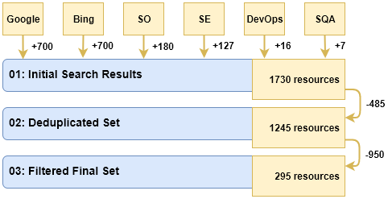

# Industry Practices and Challenges for the Evolvability Assurance of Microservices: A Systematic Grey Literature Review
This repository contains all publicly available artifacts related to a systematic grey literature review (GLR) about the evolvability assurance of microservices in industry.
We selected and analyzed 295 practitioner online resources obtained via Google, Bing, and selected StackExchange communities.
The study took place in 2020 from January to April.

## Research Objective

```
    Analyze the applied evolvability assurance
    for the purpose of knowledge generation
    with respect to common practices and challenges
    from the viewpoint of software professionals
    in the context of microservices in industry
```

## Research Questions

**RQ1:** How do software professionals structure the general evolvability assurance activities for microservices and for what reasons?

**RQ2:** What tools, metrics, and patterns do software professionals use for assuring the evolvability of microservices and with what rationales?

**RQ3:** How do software professionals perceive the quality of their microservices and assurance processes and what parts do they see as challenging?

## Results per GLR Stage


## Interview Artifacts and Results

* [GLR protocol](protocol.md)
* [GLR coding labels](coding-labels.md)
* [Interrater reliability analysis](analysis)
* GLR results:
  * [00: raw data](results/raw-data)
  * [01: deduplicated set](results/01-deduplicated.xlsx)
  * [02: filtered set](results/02-inclusion.xlsx)
  * [03: coded set with label aggregations](results/03-coded-and-aggregated.xlsx)
