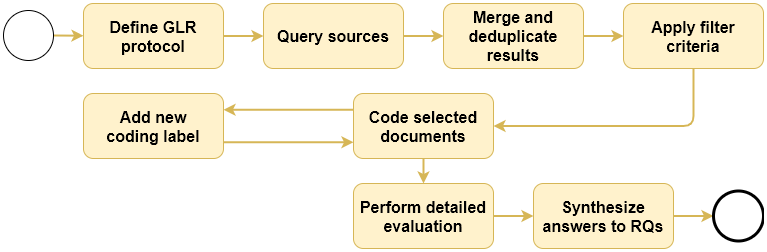

# GLR Protocol
This document describes the detailed process we followed for conducting the GLR.

## Process Overview


## Sources
- Google (https://www.google.com/advanced_search)
- Bing (https://www.bing.com)
- StackOverflow (https://data.stackexchange.com/stackoverflow/query/new)
- StackExchange Software Engineering (https://data.stackexchange.com/programmers/query/new)
- StackExchange Software Quality Assurance & Testing (https://data.stackexchange.com/sqa/query/new)
- StackExchange DevOps (https://data.stackexchange.com/devops/query/new)

## Google and Bing Search

**Search strings:**
- `microservices (maintainability | evolvability | modifiability)`
- `microservices (maintenance | evolution)`
- `microservices "quality assurance"`
- `microservices "metrics" (maintainability | evolvability | modifiability)`
- `microservices "patterns" (maintainability | evolvability | modifiability)`
- `microservices "tools" (maintainability | evolvability | modifiability)`
- `microservices (challenges | guidelines | "best practices")`

**IMPORTANT:** Set search location to United States of America and use the following suffixes to exclude unwanted sites (Google).
```
-site:youtube.com -site:researchgate.net -site:scholar.google.com -site:books.google.com -site:arxiv.org -site:springer.com -site:ieee.org -site:computer.org -site:acm.org -site:semanticscholar.org -site:amazon.com -site:amazon.ca -site:amazon.co.uk -site:amazon.in -site:amazon.es -site:amazon.com.au -site:amazon.fr
```

Bing exclusion: manually remove unwanted URLs from the results

**IMPORTANT:** For some reason, Google Search doesn’t respect the exclusion of their own sites (except YouTube). So we manually removed all result URLs from Google Search, Books, Scholar, or Translate with a RegEx (`.*google\..*\r\n`). Be careful not to remove valid results e.g. a blog post on cloud.google.com.

**IMPORTANT:** Google Search also sometimes lists several anchors for the same URL, so I also manually removed all URLs containing a `#{anchorName}` at the end.

## StackExchange SQL Query

```sql
SELECT
  Id,
  CreationDate,
  Score,
  AnswerCount
FROM Posts
WHERE PostTypeId = 1 
  AND DATEPART(yy,CreationDate) >= 2014
  AND Score >= 2
  AND (
    -- microservices
    CHARINDEX('microservice', Title) > 0
    OR CHARINDEX('microservice', Body) > 0
    OR CHARINDEX('micro service', Title) > 0
    OR CHARINDEX('micro service', Body) > 0
    OR CHARINDEX('micro-service', Title) > 0
    OR CHARINDEX('micro-service', Body) > 0
  )
  AND (
    -- QAs
    CHARINDEX('maint', Title) > 0
    OR CHARINDEX('maint', Body) > 0
    OR CHARINDEX('evol', Title) > 0
    OR CHARINDEX('evol', Body) > 0
    OR CHARINDEX('modifi', Title) > 0
    OR CHARINDEX('modifi', Body) > 0
    OR CHARINDEX('qualit', Title) > 0
    OR CHARINDEX('qualit', Body) > 0
    OR CHARINDEX('assur', Title) > 0
    OR CHARINDEX('assur', Body) > 0
    -- metrics, tools, patterns
    OR CHARINDEX('metric', Title) > 0
    OR CHARINDEX('metric', Body) > 0
    OR CHARINDEX('tool', Title) > 0
    OR CHARINDEX('tool', Body) > 0
    OR CHARINDEX('pattern', Title) > 0
    OR CHARINDEX('pattern', Body) > 0
    -- challenges, guidelines, best practices
    OR CHARINDEX('challeng', Title) > 0
    OR CHARINDEX('challeng', Body) > 0
    OR CHARINDEX('guideline', Title) > 0
    OR CHARINDEX('guideline', Body) > 0
    OR CHARINDEX('best practice', Title) > 0
    OR CHARINDEX('best practice', Body) > 0
  )
```

## Stopping Criteria

- Google / Bing: first 100 results (URLs) per search engine and search term, i.e. in the end, we will have 7 * 100 = 700 URLs per search engine (1400 in total)
- StackExchange DevOps: all results from the query above
- StackExchange Software Engineering: all results from the query above
- StackExchange SQA: all results from the query above, but body or title only need to contain a microservice-related term (not one from the second `AND` clause)
- StackOverflow: all results from the query above, but with `Score >=5`

## Inclusion and Exclusion Criteria

- **Wanted:** practitioner online publications or presentations (no peer-reviewed scientific literature, no books, no videos)
- Allowed formats:
  - Blog posts
  - News or wiki articles
  - Q&A entries
  - Tutorials (in written form)
  - Company white papers (PDFs)
  - Presentation slides
- Exclude if:
  - Source not in English
  - Scientific literature
  - Books
  - Videos
  - Announcement or description of a conference, seminar, training, etc. (concrete course material would be fine, e.g. as PDF)
  - Job offerings
- Relevance filtering (must include):
  - Description or reflection of some form of maintainability / evolvability assurance
  - Some form of systematic maintainability / evolvability construction
  - Tools, metrics, patterns (related to maintainability / evolvability)
  - Guidelines, best practices, lessons learned, challenges (related to maintainability / evolvability)
- Quality filtering (authority and experience must be sufficient):
  - Currently or in the past applied / experienced by the authors in practice
  - Not simply a hypothetical suggestion the authors thought about


